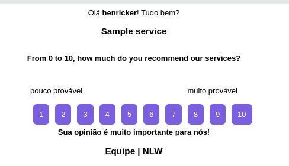

# NPS Project documentation

## About
 - Created with the support of rocketseat in the week “Next Level Week” on the NodeJ track, the most used technologies in the market to create a rest api of a NPS calculation tool (Net promoter).

## What is Promoter Score ?
  - The Net Promoter Score (NPS) is a customer satisfaction methodology developed to assess the degree of customer loyalty of any company profile.

## How did it work?
  - It is used in questions related to measuring the quality of a product or service used.

  - An example: "from 0 to 10, how much do you recommend this service to someone else?"

  - This question allows you to quickly measure the customer's feeling towards the company, as there is no greater indication of satisfaction for the company than being indicated. Since the customer indicates a high possibility of referring him, he certainly trusts the structure offered by his company and the way it delivers the product or service.

## How to calculate?

  - Promoters: Promoters: All customers who scored from 9 to 10.

  - Passive: All customers who scored from 7 to 8.

  - Destractors: Destractors: All customers who scored from 1 to 6.

  - NPS: (Promoters - Destractors) / ( all_answers)

## Technologies used
  
  - Node Js
  - TypeScript 
  - TypeORM ( ORM )
  - Sqlite ( simple database )
  - Yup ( validations ) 

## Documentation

- ### User router (localhost:3333/users)
  - Create user (Method POST):
  ```Ts
  Request: {
    "name": "henricker",
    "email": "henricker@rocketseat.com"
  }

  Response: {
    "id": "a191021f-45d0-48d2-a2cd-4804bfc5515d",
    "name": "henricker",
    "email": "henricker@rocketseat.com",
    "created_at": "2021-04-05T15:27:22.000Z"
  }
  ```

- ### Survey router (localhost:3333/surveys)

  - Create Survey (Method POST):
  ```Ts
  Request: {
    "title": "Sample service",
    "description": "From 0 to 10, how much do you recommend our services?"
  },

  Response: {
    "id": "688327ae-ba78-4337-8e9e-42a484caecc8",
    "title": "Sample service",
    "description": "From 0 to 10, how much do you recommend our services?",
    "created_at": "2021-04-05T15:25:22.000Z"
  }
  ```

  - Get surveys (Method GET): 
  ```Ts
    Response: [
      {
        "id": "688327ae-ba78-4337-8e9e-42a484caecc8",
        "title": "Sample service",
        "description": "From 0 to 10, how much do you recommend our services?",
        "created_at": "2021-04-05T15:25:22.000Z"
      }
  ] 
    ```
- ### Mail router
  - Method POST
  - SendMail (localhost:3333/sendMail):
  ```json
  request: {
    "email": "henricker@rocketseat.com",
    "survey_id": "688327ae-ba78-4337-8e9e-42a484caecc8"
  },

  response: {
    "id": "90b82f8b-aea3-4ea9-a8e5-12dc6a326e89",
    "user_id": "a191021f-45d0-48d2-a2cd-4804bfc5515d",
    "survey_id": "688327ae-ba78-4337-8e9e-42a484caecc8",
    "value": null,
    "created_at": "2021-04-05T15:40:34.000Z",
    "user": {
       "id": "a191021f-45d0-48d2-a2cd-4804bfc5515d",
      "name": "henricker",
      "email": "henricker@rocketseat.com",
      "created_at": "2021-04-05T15:27:22.000Z"
    },
    "survey": {
      "id": "688327ae-ba78-4337-8e9e-42a484caecc8",
      "title": "Sample service",
      "description": "From 0 to 10, how much do you recommend our services?",
      "created_at": "2021-04-05T15:25:22.000Z"
  }
  }
  ```
Email received:


 - When you click on any alternative, you will be redirected to "localhost:3333/:value?u=id_survey"

- ### NPS route
  - Calculate route
    - localhost:3333/nps/:survey_id
    - Method GET
  ```json
  //exemple: 
    response: {
    "detractors": 0,
    "passive": 0,
    "promoters": 1,
    "totalAnswers": 1,
    "nps": 1
    }
  ```

- This is my project, any question call me in my email or linkedin :)
- I am open to criticism and suggestions on how to improve my project.

Goodbye, until the next project :)